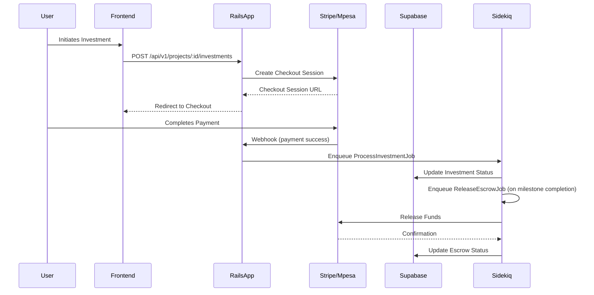
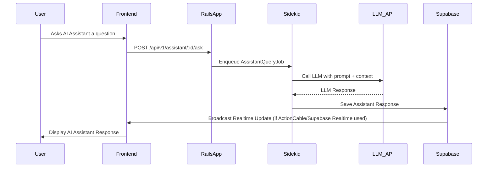

# +A_DevAfrica Platform Architecture

This document outlines the high-level architecture and key components of the +A_DevAfrica platform.

## 1. Overview

The +A_DevAfrica platform is a full-stack web application designed to facilitate project funding, community engagement, and AI-powered assistance. It follows a modular architecture, leveraging Ruby on Rails for the backend, Hotwire/Turbo/Tailwind for a dynamic frontend, and Supabase for robust data management and storage.

## 2. Core Components

### 2.1. Backend (Ruby on Rails)

*   **Framework**: Ruby on Rails
*   **Purpose**: Handles business logic, API endpoints, data persistence, and server-side rendering.
*   **Key Features**:
    *   **MVC Pattern**: Standard Rails Model-View-Controller architecture for clear separation of concerns.
    *   **Active Record**: ORM for interacting with the PostgreSQL database.
    *   **Action Cable**: For real-time features (e.g., live vote updates).
    *   **Active Job**: For managing background tasks with Sidekiq.
    *   **Pundit**: For authorization and access control.
    *   **Devise**: For user authentication.

### 2.2. Frontend (Hotwire/Turbo/Tailwind)

*   **Technologies**: Hotwire (Turbo, Stimulus), Tailwind CSS, ESBuild.
*   **Purpose**: Provides a dynamic, responsive, and fast user interface.
*   **Key Features**:
    *   **Hotwire (Turbo)**: Delivers HTML over the wire, enabling single-page application (SPA) like experiences without writing much JavaScript.
    *   **Stimulus**: A modest JavaScript framework for adding behavior to HTML, used for reactive elements like filters, infinite scroll, and live updates.
    *   **Tailwind CSS**: A utility-first CSS framework for rapid UI development and consistent styling.
    *   **ESBuild**: For fast JavaScript bundling.

### 2.3. Database & Storage (Supabase)

*   **Database**: PostgreSQL (managed by Supabase)
*   **Storage**: Supabase Storage (S3-compatible object storage)
*   **Purpose**: Provides a scalable and secure database, authentication services, and file storage.
*   **Key Features**:
    *   **Row-Level Security (RLS)**: Granular access control for database rows.
    *   **Realtime**: Pub/Sub functionality for instant updates.
    *   **Auth**: User authentication and management.
    *   **Functions**: Stored procedures and triggers.

### 2.4. Background Jobs (Sidekiq & Redis)

*   **Job Processor**: Sidekiq
*   **Message Broker**: Redis
*   **Purpose**: Handles long-running tasks asynchronously to improve application responsiveness.
*   **Examples**: Processing payments, sending emails, AI assistant queries, escrow release.

## 3. Integrations

### 3.1. Payment Gateways

*   **Stripe**: For credit card payments and escrow management.
*   **M-Pesa**: For mobile money payments (specific to African markets).
*   **Components**: `StripeService`, `MpesaService`, `PaymentsController`, `Investment` model.

### 3.2. AI Assistants

*   **External LLM APIs**: Mistral, OpenAI.
*   **Components**: `AssistantService`, `Assistant` model, `AssistantQueryJob`.
*   **Flow**: User query -> Rails backend -> `AssistantService` calls LLM -> results saved and broadcast to UI.

### 3.3. Mapping & Geospatial

*   **Mapbox**: For interactive maps and location services.
*   **Components**: `MapLocation` model, frontend integration.

## 4. Data Flow Diagrams

### 4.1. Investment & Escrow Flow

### 4.2. AI Assistant Query Flow

## 5. Security Considerations

*   **Authentication**: Devise for user sessions, optional JWT for API.
*   **Authorization**: Pundit policies for granular access control.
*   **Row-Level Security (RLS)**: Implemented in Supabase for direct client access protection.
*   **Rate Limiting**: Rack-attack for preventing abuse.
*   **PII Protection**: Encryption of sensitive data, limited access via roles.

## 6. Deployment

The application is designed for deployment on Render, utilizing separate services for the web application and Sidekiq workers. Supabase provides the managed PostgreSQL database and storage. Details are in `DEPLOYMENT.md`.

